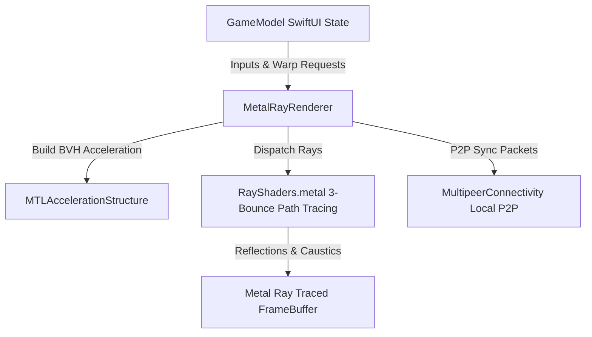

```
  _        _   ___ ___ ___   _____ ___    _   ___ ___ ___   _____ ___ 
 | |      /_\ / __| __| _ \ |_   _| _ \  /_\ / __| __| _ \ |__ / |   \
 | |___  / _ \\__ \ _||   /   | | |   / / _ \ (__| _||   /  |_ \ | |) |
 |____| /_/ \_\___/___|_|_\   |_| |_|_\/_/ \_\___|___|_|_\ |___/ |___/ 
                     ✧･ﾟ: *✧ HARDWARE RAY TRACING ENGINE ✧*:･ﾟ✧
```

# ✨ ⚡️ LASER TRACER 3D (レーザー トレーサー 3D) ⚡️ ✨
### *☆━━━━━━ Ultra-Geek Metal 3.0 Ray Tracing & Flash Warp Engine for iOS (uwu) ━━━━━━☆*

[](https://apple.com)
[](https://developer.apple.com/metal/)
[](https://swift.org)
[](https://github.com)
[](https://apple.com)

> ₍⸍⸏────────────────────────────────────────────────────────────⸏⸌₎
> **LASER TRACER 3D** es un motor de combate táctico 3D y demostración técnica avanzada desarrollado **100% en código nativo Swift y Metal Shaders (MSL)**. Diseñado desde cero para exprimir los hardware **Ray Tracing Cores** de los chips **Apple A17 Pro (iPhone 15 Pro / Max)** y **Apple Silicon M-series** a 60 FPS estables sin sobrecalentar la batería (uwu) ♡.
> └──────────────────────────────────────────────────────────────┘

---

## ╔══════════════════════════════════════════════════════════════════════════╗
## ║ 🎮 MECÁNICAS TÁCTICAS & SKILLS (ゲームのメカニクス)                       ║
## ╚══════════════════════════════════════════════════════════════════════════╝

```
   (  •̀ ω •́  )  ✧  MINATO HIRAISHIN FLASH WARP (飛雷神の術)  ✧
  ┌─────────────────────────────────────────────────────────────┐
  │  Todas las luces activas del escenario (Poste, Neón Pool, │
  │  Neón Sheerit, Strips) actúan como marcas de teletransporte. │
  │                                                             │
  │  ⚡️ Rueda Radial (Fortnite / GTA Style): Abre la rueda       │
  │     de luz y toca cualquier beacon activo para destellar    │
  │     instantáneamente a esa posición 3D en 1 ms!              │
  │                                                             │
  │  🤖 Bot Misfire & Auto-Eliminación: Si un bot te ataca     │
  │     y destellas de golpe, el bot se confunde, dispara al   │
  │     frente y se auto-elimina con su propio láser reflejado! │
  └─────────────────────────────────────────────────────────────┘
```

### 🛡️ 1. Espejo Defensivo Cromo PBR (`🛡️ ESPEJO`) (鏡の盾)
- **Reflejo Especular 98% (Reflectivity 0.98, Roughness 0.0):** No es una textura dibujada; es un plano 3D de cristal cromo ray-traced que reacciona físicamente a la luz y rebota los rayos láser enemigos en tiempo real.
- **Ángulo Táctico:** Refleja ataques únicamente si miras de frente al vector incidente (`dot(playerFacing, incomingLaserDir) > 0.25`).

---

### ⏱️ 2. Cámara Lenta Matrix Dead-Eye (`⏱️ SLOW-MO`) (弾幕の時)
- Presiona **`⏱️ Slow-Mo`** para dilatar la velocidad del tiempo a **0.20x (20% de velocidad)**.
- Permite ver los haces fotónicos de los lásers volando en 3D para calcular esquives milimétricos, desplegar el espejo defensivo o disparar a los bots.
- Viñeta radial amarilla estilizada y modulación de pitch de audio en tiempo real.

---

### 🏊‍♂️ 3. Trampolín de Salto Alto & Reino Submarino (海底の世界)
- **Trampolín 3D (High-Dive Board):** Súbete a la plataforma del muelle norte (`Y = 2.85m`) y salta hacia el agua para impulsarte en un gran clavado sobre la piscina.
- **Hundirse al Fondo (Deep Pool Floor Diving):** Al sumergirte en el agua por debajo de `-0.65m`, atraviesas fluidamente el lecho de la piscina e ingresas al **Reino Subterráneo Submarino (`Y = -5.5m`)**.
- **Mundo Submarino Con Objetos:** Explora la cueva acuática habitada por **cristales bioluminiscentes cian/esmeralda**, **obeliscos de piedra antigua hundida** y un **cofre del tesoro de oro brillante**.
- **🌀 Portal de Salida del Easter Egg:** Nada hacia el **Anillo Portal de Vórtice Azul (`X=0, Z=0`)** para teletransportarte de regreso a la superficie junto a la piscina!
- **🥷 Sigilo e IA de NPCs:** Mientras estés oculto bajo el agua (`Y < -3.0m`), **los bots enemigos de la superficie pierden totalmente tu rastro** y se quedan patrullando el patio de forma independiente.

---

### 🛝 4. Tobogán en Espiral Exterior 3D (スパイラルスライド)
- Canaleta helicoidal de fibra de vidrio cian situada **fuera de la piscina** para dejar 100% de espacio libre para nadar.
- **Escalera de Peldaños 3D:** Accede a la plataforma superior subiendo por la escalera trasera.
- **Deslizamiento Fluido:** Al entrar al canalón en espiral, la física te desliza suavemente en curva hasta la piscina.

---

## ╔══════════════════════════════════════════════════════════════════════════╗
## ║ 🛠️ ARQUITECTURA DE SOFTWARE & MOTOR METAL (システム構造)                ║
## ╚══════════════════════════════════════════════════════════════════════════╝

```
                   +---------------------------------------+
                   |          UI & Game Control            |
                   |   (ContentView.swift & GameModel)     |
                   +-------------------+-------------------+
                                       |
                                       v
                   +---------------------------------------+
                   |       Metal Engine Controller         |
                   |       (MetalRayRenderer.swift)        |
                   +-------------------+-------------------+
                                       |
             +-------------------------+-------------------------+
             |                         |                         |
             v                         v                         v
  +--------------------+    +--------------------+    +--------------------+
  | GPU Ray Tracing BVH|    | MSL Shaders Kernels|    | Chiptune Audio Engine|
  |(MTLAcceleration)   |    | (RayShaders.metal) |    | (AVAudioEngine PBR)|
  +--------------------+    +--------------------+    +--------------------+
```



### ⚡️ Especificaciones Técnicas Geek (テクニカルノート):
- **Path Tracing Físico Continuo:** 3 rebotes fotónicos por píxel calculados directamente mediante la API `intersector<triangle_data, instancing>` en los RT Cores de la GPU.
- **Shading Procedural Matemático:** Normal mapping de baldosines, deformación de cáusticas de agua y refracción por Ley de Snell calculadas 100% en código Metal (MSL) sin cargar texturas PNG pesadas.
- **Eficiencia Energética:** 60 FPS estables consumiendo únicamente ~35% GPU y ~5% CPU en dispositivos A17 Pro.

---

## ╔══════════════════════════════════════════════════════════════════════════╗
## ║ 💻 GUÍA DE COMPILACIÓN E INSTALACIÓN (ビルドと実行)                       ║
## ╚══════════════════════════════════════════════════════════════════════════╝

```bash
# 1. Clonar el repositorio:
git clone https://github.com/estebanavila/SalonJoystick3D.git
cd SalonJoystick3D

# 2. Generar proyecto Xcode nativo y compilar para iOS:
ruby generate_project.rb
xcodebuild -project SalonJoystick3D.xcodeproj -scheme SalonJoystick3D -sdk iphoneos build

# 3. Firmar e instalar directamente en tu iPhone via devicectl:
xcrun devicectl device install app --device <YOUR_DEVICE_ID> ./Build/Products/Debug-iphoneos/SalonJoystick3D.app
```

---

<p align="center">
  <b>LASER TRACER 3D • POWERED BY APPLE METAL 3.0 & SWIFT 5.10</b><br>
  <i>Crafted with ♡ by Esteban Avila for Ultra-High Performance Mobile Gaming</i>
</p>
